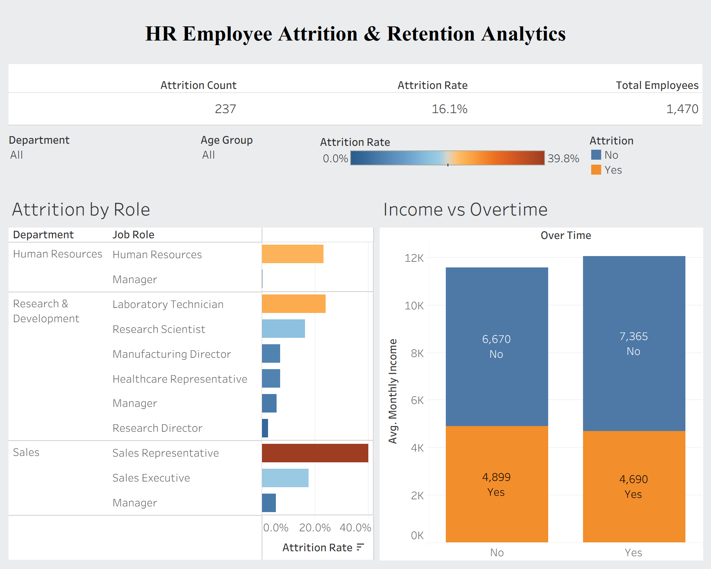

# 📊 HR Employee Attrition & Retention Analytics

An end-to-end interactive Tableau dashboard built to identify key drivers of employee turnover, compensation disparities, and high-risk job roles to support strategic HR decision-making.

---

## 📸 Dashboard Overview

---

## 🎯 Key Business Insights & Findings

* **High-Risk Roles**: **Sales Representatives** exhibit the highest turnover rate (**~39.8%**), followed by **Laboratory Technicians** (**~23.9%**) and **Human Resources Managers** (**~23.1%**).
* **Income & Overtime Correlation**: Employees who left the company (*Attrition: Yes*) earned significantly lower average monthly incomes ($4,899 without overtime, $4,690 with overtime) compared to retained peers ($6,670+).
* **Retention Drivers**: Low compensation coupled with mandatory overtime is the primary catalyst driving turnover in frontline operational roles.

---

## 🛠️ Data & Tech Stack

* **Analytics & Visualization**: Tableau Desktop
* **Dataset**: IBM HR Employee Attrition Dataset (1,470 employee records)
* **Key Calculated Fields**:
  * `Attrition Count`: `IF [Attrition] = 'Yes' THEN 1 ELSE 0 END`
  * `Attrition Rate`: `SUM([Attrition Count]) / COUNT([Age])`
  * `Age Group`: Categorical binning (`<30`, `30-40`, `41-50`, `51+`)

---

## 📂 Repository Structure

* `HR_Employee_Attrition_Dashboard.twbx` — Full packaged Tableau workbook.
* `WA_Fn-UseC_-HR-Employee-Attrition.csv` — Raw HR dataset.
* `dashboard_preview.png` — Dashboard visual preview.
